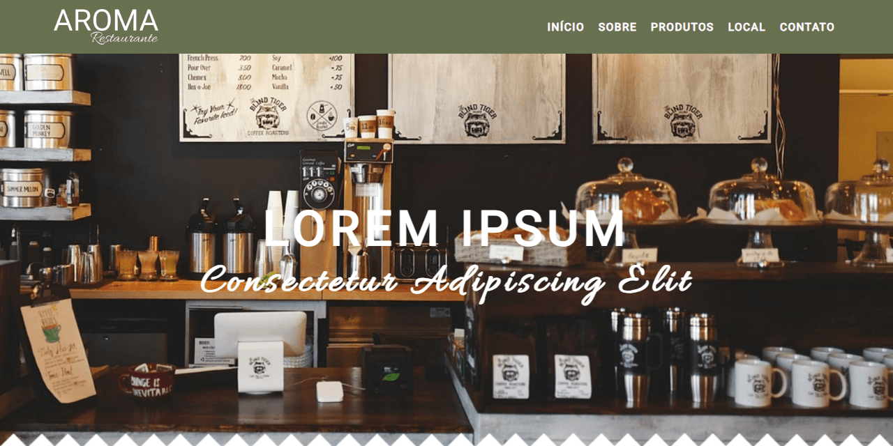
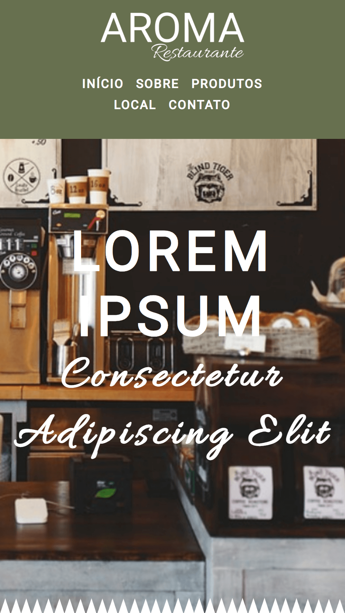

# **Aroma Reataurante**

Acesse o Projeto: [Aroma Restaurante Angular](https://aroma-restaurante.vercel.app/)

## Sobre o projeto

A Landing Page do Aroma Restaurante foi criada com eficiência e elegância, combinando Angular para performance otimizada. Utilizando TypeScript para garantir segurança de tipos, Flexbox para um layout flexível. A organização de arquivos e pastas é meticulosa, aproveitando ao máximo o uso de componentes para uma manutenção simplificada.

#### About the project

Aroma Restaurante's Landing Page was created with efficiency and elegance, combining Angular for optimized performance. Using TypeScript to ensure type safety, Flexbox for flexible layout. The organization of files and folders is meticulous, making the most of the use of components for simplified maintenance.

## Mobile Layout

## Tecnologias Utilizadas (Technologies Used)
* HTML5
* CSS3
* Flexbox
* JavaScript
* Typescript
* Angular

## Instalação (Installation)

##### Instalar Dependências (Install Dependencies)
<pre><code>npm install</code></pre>

##### Executar Aplicação (Run Application)
<pre><code>ng s</code></pre>

## Autor (Author)

#### **Katarine Albuquerque**

 &nbsp; 
